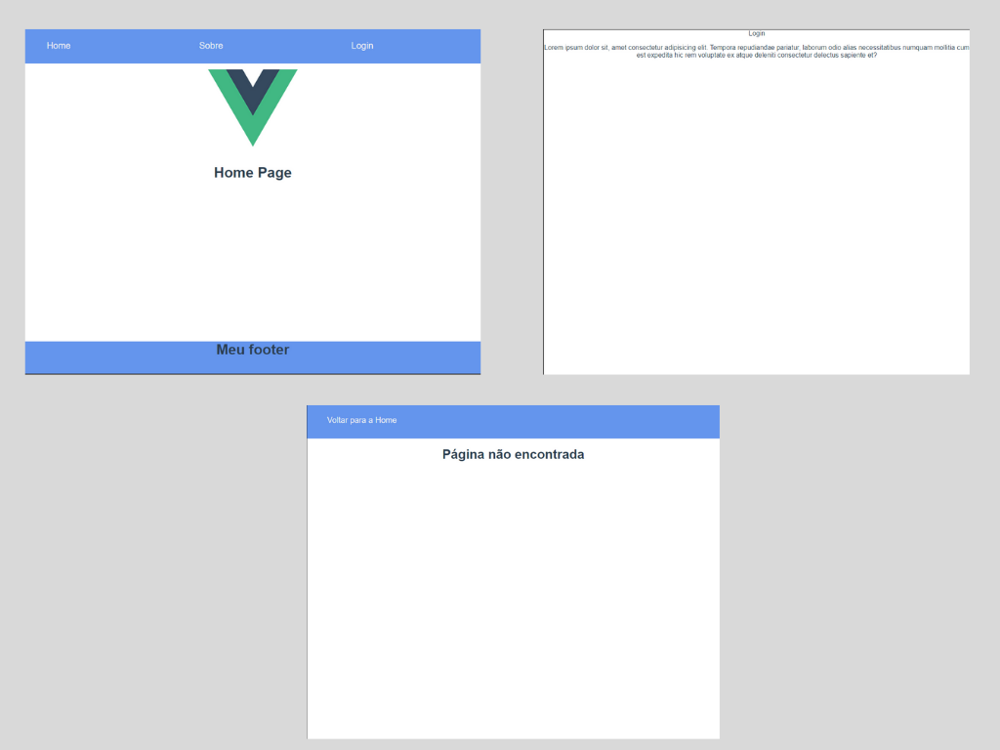

# Layout Dinamico com Vue 3

## Tutorial de como criar um layout dinamico com Vue 3
- [Artigo Medium](https://pablorf10.medium.com/layout-din%C3%A2mico-com-vue-3-3220b8ec7463) - HTML
```
npm install
```

### Compiles and hot-reloads for development
```
npm run serve
```

<p align="center"> 
    
 </p>
